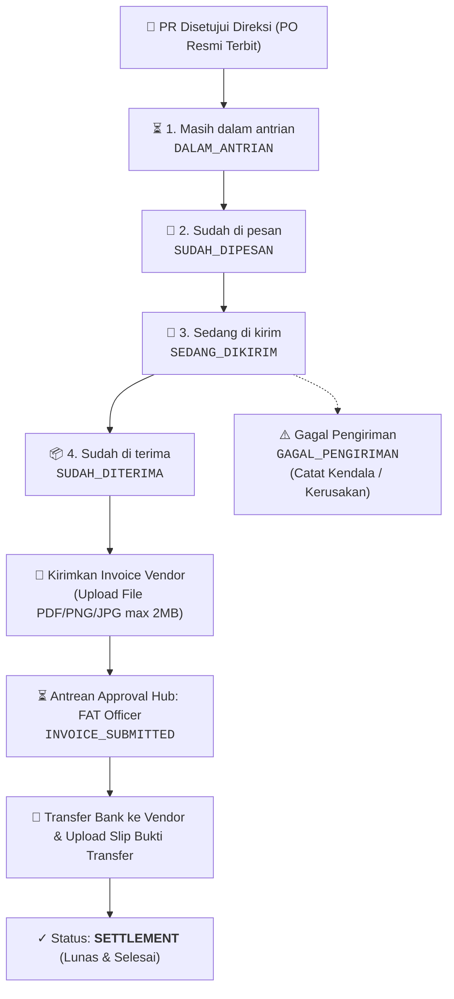

# 🌟 Walkthrough: Modul Utama "Pesanan" & Pembaharuan Pengadaan ERP MMS v3.2

Dokumentasi lengkap implementasi modul utama **"Pesanan" (PO Execution, Delivery Tracking & FAT Invoice Settlement)** serta fitur **Klaim Reimbursement Operasional** pada ERP MMS v3.2.

---

## 📦 1. Modul Utama "Pesanan" (PO Execution & Tracking)

Modul **"Pesanan"** dirancang khusus untuk memonitor, mengeksekusi, dan mentracking seluruh Purchase Requisitions (PR) yang telah disetujui penuh oleh Direksi (*APPROVED / COMPLETED / PO Terbit*).

---

## 👥 2. Hak Akses & Pembagian Visibilitas (Role-Based Scoping Matrix)

Sesuai instruksi dan struktur RBAC Yayasan MMS, modul **Pesanan** menerapkan pembagian visibilitas dan hak kontrol sebagai berikut:

| Kategori Akun / Pengguna | Cakupan Data Pesanan yang Tampil | Hak Akses & Kontrol di Tabel |
| :--- | :--- | :--- |
| **Operator Utama** 1. `SA-002` (Muhammad Syafiq Al Ghifari) 2. `SO-004` (Syifa Izzatina) | **Seluruh Pesanan Yayasan (Global View)** | **Full Control**: Mengubah status pesanan via dropdown langsung, mencatat alasan gagal kirim, dan mengunggah invoice supplier untuk diteruskan ke FAT. |
| **FAT Officer** (`FAT-001` / `usr-checker`) | **Seluruh Pesanan Yayasan (Global View)** | **Settlement & Audit**: Memverifikasi berkas invoice supplier di Approval Hub, mengunggah bukti transfer pelunasan, dan memantau seluruh pesanan. |
| **Jajaran Direksi & Super Admin** (`DIREKTUR_UTAMA`, `DIREKTUR_OPERASIONAL`, `DIREKTUR_KEUANGAN`, `SUPER_ADMIN`) | **Seluruh Pesanan Yayasan (Global View)** | **Executive Oversight & Management**: Mengawasi seluruh pesanan yayasan dan status pengadaan di semua lokasi dapur. |
| **Semua Akun Pemohon Lainnya** *(Manager Area, Staff Lapangan, Surveyor, Perwakilan Yayasan, HC, dsb.)* | **Hanya Pesanan dari Pengajuan PR Mereka Sendiri (Scoped Tracking View)** | **Read-Only Tracking**: Memantau progress status pengadaan mereka (badge status rapi), melihat Log Audit Detail, foto PR, dan mengecek bukti transfer FAT saat pesanan telah settlement/lunas. |

---

## ⚙️ 3. Fitur & Teknis Modul Pesanan

### A. Scoped Personal Tracking & Header Dinamis
* **Header & Banner Adaptif**: Menampilkan label *"📦 PO Execution & Delivery Tracking"* untuk Operator/Direksi/FAT, dan *"🔍 Pelacakan Pesanan Mandiri"* untuk pemohon umum beserta nama pemohon.
* **HUD Metrics Tersinkronisasi**: Kartu KPI dan counter filter badge secara dinamis menghitung data pesanan yang relevan sesuai akun yang sedang aktif.
* **Tampilan Status Bersih untuk Non-Operator**: Pemohon reguler melihat badge status visual yang informatif tanpa intervensi dropdown yang membingungkan.

### B. 5 Pilihan Status Resmi (Dropdown Langsung di Tabel untuk Operator)
Perubahan status dilakukan secara instan melalui dropdown interaktif pada baris tabel (khusus akun operator/direksi):
1. **Masih dalam antrian** (`DALAM_ANTRIAN`): Status awal otomatis setelah PR disetujui Direksi.
2. **Sudah di pesan** (`SUDAH_DIPESAN`): Barang telah dipesankan ke rekanan/supplier.
3. **Sedang di kirim** (`SEDANG_DIKIRIM`): Barang dalam perjalanan kurir/ekspedisi.
4. **Sudah di terima** (`SUDAH_DITERIMA`): Barang telah tiba di lokasi dapur penerima. Memunculkan tombol **"📄 Kirimkan Invoice"** bagi operator.
5. **Gagal Pengiriman** (`GAGAL_PENGIRIMAN`): Apabila barang tidak sesuai atau rusak saat tiba di lokasi. Membuka modal input penjelasan kendala dan mencatat log audit.

### C. Modal "Kirimkan Invoice Vendor ke FAT" (Ringkas & Efisien)
* **User Experience Ringkas**: Cukup hanya **Upload File Invoice / Kuitansi (PNG/JPG/PDF, max 2 MB)** tanpa perlu mengisi ulang form yang redundan.
* Sistem otomatis membaca data PR (ID, Nama Barang, Total Budget, Dapur Penerima) dan langsung meneruskannya ke antrean **FAT Officer** (`INVOICE_SUBMITTED`).

### D. Antrean Approval Hub: FAT Officer & Settlement
* FAT Officer (`FAT-001` Muhammad Imam Adamy) menerima notifikasi dan kartu antrean di **Approval Hub** pada filter **Invoice Pesanan (FAT)**.
* FAT Officer dapat melakukan **Pratinjau Berkas Invoice Vendor (Lightbox/PDF)**, mengisi nomor referensi transfer bank, melampirkan foto slip transfer, dan mengonfirmasi pelunasan.
* Status pesanan berubah menjadi **`SETTLEMENT`** (Selesai & Lunas).
* Seluruh pihak terkait (operator maupun pemohon PR bersangkutan) dapat langsung melihat dan mengunduh **Bukti Transfer Bank** dari FAT di tabel Pesanan.

### F. Desain Responsif Mobile & Desktop (Hybrid Layout)
* **Desktop & Tablet View (`> 768px`)**: Tabel berdensitas tinggi dengan `min-width: 1100px` dan scroll horizontal yang mulus tanpa teks terjepit.
* **Mobile Card View (`<= 768px`)**: Kartu pesanan mandiri yang proporsional, rapi, dan lega di layar smartphone, memuat:
  - Header badge ID PR, tanggal, dan status PO resmi.
  - Nama barang, kuantiti, dan nominal anggaran dengan font monospaced emas yang menonjol.
  - Kotak informasi dapur SPPG dan pemohon yang jelas terbaca tanpa terpotong.
  - Dropdown kontrol status (operator) atau status badge visual (pemohon).
  - Box info status tagihan vendor dan tombol aksi (Kirim Invoice / Cek Invoice / Bukti Transfer).
  - Tombol aksi: Log Detail PO & Foto PR Lightbox.

---

## 💻 4. Berkas yang Diperbarui / Dibuat

| Berkas / Modul | Rincian Perubahan |
| :--- | :--- |
| [`js/modules/pesanan.js`](file:///c:/Users/muham/Documents/SISTEM%20ERP/ERP%20MMS%20v3.2/js/modules/pesanan.js) *(BARU)* | Modul Pesanan: Scoping visibilitas data, 4 HUD metrics, filter pills, search input, tabel tracking pesanan dengan dropdown status untuk operator, **Hybrid Responsive Mobile Cards**, modal upload invoice vendor (single-file upload max 2MB), modal catatan gagal pengiriman, modal timeline riwayat log, viewer invoice dan bukti transfer bank. |
| [`css/style.css`](file:///c:/Users/muham/Documents/SISTEM%20ERP/ERP%20MMS%20v3.2/css/style.css) | Menambahkan class `.pesanan-desktop-view` dan `.pesanan-mobile-view` beserta breakpoint `@media (max-width: 768px)` untuk rendering kartu mobile yang proporsional. |
| [`js/modules/data.js`](file:///c:/Users/muham/Documents/SISTEM%20ERP/ERP%20MMS%20v3.2/js/modules/data.js) | Menambahkan methods `getApprovedOrders()`, `updateOrderStatus()`, `submitOrderInvoice()`, `disburseOrderInvoice()`, `fetchOrderInvoiceAttachment()`, `fetchOrderTransferProof()`, update `getPendingApprovalsCount()`, serta mapping sinkronisasi Supabase Cloud. |
| [`js/modules/approval-center.js`](file:///c:/Users/muham/Documents/SISTEM%20ERP/ERP%20MMS%20v3.2/js/modules/approval-center.js) | Menambahkan filter tab dan antrean pending settlement invoice vendor untuk FAT Officer, modal transfer pembayaran vendor (`openDisburseOrderInvoiceModal`), preview invoice, dan audit log riwayat settlement. |
| [`js/app.js`](file:///c:/Users/muham/Documents/SISTEM%20ERP/ERP%20MMS%20v3.2/js/app.js) | Mendaftarkan route `'pesanan'`, sinkronisasi badge counter aktif (`#badge-pesanan-count`) berbasis role scoping, dan navigasi. |
| [`index.html`](file:///c:/Users/muham/Documents/SISTEM%20ERP/ERP%20MMS%20v3.2/index.html) | Menambahkan tombol navbar pill `Pesanan`, tombol drawer mobile `Pesanan & PO`, modal global lightbox, dan registrasi script `pesanan.js`. |
| [`js/modules/pengajuan-barang.js`](file:///c:/Users/muham/Documents/SISTEM%20ERP/ERP%20MMS%20v3.2/js/modules/pengajuan-barang.js) | Menambahkan tombol navigasi cepat ke **Pesanan & PO**. |
| [`js/modules/cash-advance.js`](file:///c:/Users/muham/Documents/SISTEM%20ERP/ERP%20MMS%20v3.2/js/modules/cash-advance.js) | Menambahkan tombol navigasi cepat ke **Pesanan & PO**. |
| [`js/modules/reimburse.js`](file:///c:/Users/muham/Documents/SISTEM%20ERP/ERP%20MMS%20v3.2/js/modules/reimburse.js) | Menambahkan tombol navigasi cepat ke **Pesanan & PO**, ID SPPG pada dropdown dapur, dan lazy loading bukti struk. |
| [`schema_supabase.sql`](file:///c:/Users/muham/Documents/SISTEM%20ERP/ERP%20MMS%20v3.2/schema_supabase.sql) | Menambahkan kolom `order_status`, `order_tracking_history`, `order_invoice`, `order_disbursement` pada tabel `item_requests` dan skrip migrasi `ALTER TABLE`. |

---

## 🧪 5. Verifikasi & Pengujian

- ✅ **Tampilan Mobile Proporsional (Mobile Card Layout)**: Pada layar HP/smartphone (`<= 768px`), tabel padat secara otomatis bertransformasi menjadi **kartu pesanan vertikal yang lega, estetik, dan proporsional**. Teks dapur, nama barang, pemohon, dan nominal anggaran tersusun rapi tanpa ada teks yang tertekan menjadi 1 huruf vertikal.
- ✅ **Tampilan Desktop & Tablet Aman**: Pada layar desktop/laptop/tablet, tabel memiliki pengaman `min-width: 1100px` dan container dengan horizontal touch-scroll sehingga seluruh 7 kolom data tetap lebar dan proporsional.
- ✅ **Pemisahan Hak Visibilitas Data (Role-Based Scoping)**:
  - Akun **Syifa Izzatina** (`SO-004`), **Muhammad Syafiq Al Ghifari** (`SA-002`), **FAT Officer** (`FAT-001`), dan **Direksi / Super Admin** dapat melihat **SELURUH** pesanan pengadaan se-yayasan.
  - Akun **selain mereka** (misalnya Rendy Seftiana / Manager Area / Surveyor / Staff) **HANYA** melihat tracking pesanan yang diajukan oleh mereka sendiri.
- ✅ **Akses Operator Terverifikasi**: Akun `SA-002` (Muhammad Syafiq Al Ghifari) dan `SO-004` (Syifa Izzatina) memiliki hak penuh untuk mengubah status pesanan melalui dropdown langsung dan mengunggah invoice vendor.
- ✅ **Proteksi Akun Pemohon Reguler**: Akun pemohon reguler melihat badge status yang rapi (non-editable status dropdown) dan tetap dapat melihat detail log riwayat pengiriman barang, foto PR, serta melihat slip transfer FAT saat pesanan telah settlement (Lunas).
- ✅ **Live Filter & Keyword Search**: Filter tabs dan kotak pencarian real-time berfungsi responsif di seluruh kartu mobile maupun baris tabel desktop.

---

## 💵 6. Pembaharuan Form Cash Advance: Target Lokasi / Titik SPPG Dropdown

Telah diperbarui field **Target Lokasi / Titik SPPG** pada Form Pengajuan Cash Advance (Kasbon Operasional) di [`js/modules/cash-advance.js`](file:///c:/Users/muham/Documents/SISTEM%20ERP/ERP%20MMS%20v3.2/js/modules/cash-advance.js):

1. **Dropdown Berbasis Database SPPG**: Menampilkan seluruh titik SPPG resmi dari database yayasan lengkap dengan **ID SPPG** pada setiap opsinya (contoh: `THAH6JZO — SPPG Bandung Nagreg Citaman 2 (Kab. Bandung)`).
2. **Filter Delegasi Khusus Perwakilan Yayasan**: Untuk pengguna ber-role `PERWAKILAN_YAYASAN`, opsi dropdown otomatis difilter sehingga **hanya memunculkan SPPG yang didelegasikan** ke akun bersangkutan.
3. **Opsi "➕ Lainnya (Input Manual)"**: Memungkinkan pemohon memilih `__MANUAL__` yang secara otomatis menampilkan input teks tambahan jika kebutuhan operasional lapangan berada di luar titik SPPG terdaftar.
4. **Validasi & Integrasi Data**: Sistem memastikan nilai lokasi (baik dari pilihan dropdown SPPG maupun input manual) tervalidasi dan tersimpan rapi pada record Cash Advance di database lokal dan Supabase Cloud.

---

## 🔑 7. Penambahan Hak Akses Lengkap Admin Hub untuk Akun FAT-001

Telah dikonfigurasi hak akses penuh **Admin Hub** untuk akun pengguna:
- **Nama**: Muhammad Imam Adamy
- **ID Pengguna**: `FAT-001`
- **NIKA**: `K-2026-012`
- **Role**: `FAT_OFFICER` (Finance Accounting and Tax)

### Cakupan Akses Lengkap yang Diberikan:
1. **Navigasi Navbar & Mobile Drawer**: Menu **Admin Hub** kini otomatis tampil pada navigasi desktop pill maupun drawer smartphone saat login menggunakan akun `FAT-001`.
2. **Sub-Menu 1: Daftar Dapur (Master SPPG)**: Akses penuh melihat 15 master titik dapur program, mendaftarkan dapur baru, dan memperbarui informasi titik dapur yayasan.
3. **Sub-Menu 2: Laporan Dapur & Saldo VA**: Akses penuh monitoring transaksi harian dapur program, kalkulasi porsi, realisasi belanja bahan baku SPM, dan mutasi saldo Virtual Account.
4. **Sub-Menu 3: Daftar Kendala Dapur SPPG**: Akses penuh monitoring kendala operasional lapangan di setiap titik SPPG serta merespons/menindaklanjuti kendala yang dilaporkan.

---

## 📑 8. Penambahan Kolom Link SPM (Format Hyperlink) pada Export Excel Saldo VA

Telah ditambahkan kolom baru pada **Sheet 1 (Pelaporan Saldo VA & Transaksi)** pada fitur **Export Excel Multi-Sheet (.xlsx / .xls)** di [`js/modules/dapur-yayasan.js`](file:///c:/Users/muham/Documents/SISTEM%20ERP/ERP%20MMS%20v3.2/js/modules/dapur-yayasan.js):

1. **Kolom "Link Dokumen SPM (Nota Belanja)"**:
   - Menampilkan link dokumen SPM / Surat Perintah Membayar bahan baku yang diunggah oleh Maker Yayasan.
   - Menggunakan atribut `ss:HRef` dan styling SpreadsheetML `CellHyperlink` (warna biru dan bergaris bawah), sehingga saat dibuka di Microsoft Excel, Google Sheets, LibreOffice, atau WPS Office, link tersebut **dapat langsung diklik (hyperlink interaktif)** dan membuka berkas/folder Google Drive nota asli di browser.
2. **Fallback Teks Rapi**: Jika tidak terdapat link atau dokumen SPM berupa catatan lokal, sel otomatis menampilkan tanda `-` atau nama file secara proporsional.
3. **Pemberian Hak Akses Export ke FAT Officer**: Akun `FAT-001` (Muhammad Imam Adamy) kini juga memiliki wewenang untuk mengekspor rekapitulasi Excel Saldo VA & Status Dapur.
4. **Perbaikan Query Tarik Data Supabase (`spm_attachment_url`)**: Kolom `spm_attachment_url` telah ditambahkan ke dalam klausa query `pullFromSupabase()` di [`js/modules/data.js`](file:///c:/Users/muham/Documents/SISTEM%20ERP/ERP%20MMS%20v3.2/js/modules/data.js), sehingga seluruh tautan Google Drive / bit.ly yang tersimpan di cloud database ditarik secara utuh dan menjadi hyperlink aktif di file Excel.

---

## 🏛️ 9. Perbaikan Riwayat Approval & Export Data Pengajuan (Universal Approval Hub)

Telah diperbaiki masalah hilangnya riwayat persetujuan (*Riwayat Approval Saya*) pada akun Direktur Operasional (`Muhammad Alfaqih`) dan seluruh pejabat approver di **Universal Approval Hub** ([`js/modules/approval-center.js`](file:///c:/Users/muham/Documents/SISTEM%20ERP/ERP%20MMS%20v3.2/js/modules/approval-center.js)) serta sinkronisasi database cloud ([`js/modules/data.js`](file:///c:/Users/muham/Documents/SISTEM%20ERP/ERP%20MMS%20v3.2/js/modules/data.js)):

### Akar Penyebab Masalah (*Root Cause*):
1. **Pengecekan Strict Array & Nilai Kosong/Null di Database**:
   - Sebagian riwayat pengadaan lama (*PR-2026-046 s/d PR-2026-059*), Cash Advance, Cuti, dan Reimbursement yang sudah disetujui sebelumnya tersimpan di Supabase dengan kolom `approval_history` bernilai `null` atau format single-object (`{...}` alih-alih `[{...}]`).
   - Fungsi `getMyApprovalHistory()` sebelumnya hanya mencari riwayat jika `l.approvalHistory.find(isUserApprovalActor)` menemukan data langkah spesifik. Karena bernilai `null`/bukan array, fungsi tersebut mengabaikan seluruh pengajuan yang sudah disetujui sehingga hanya memunculkan 1 pengajuan yang baru saja ditolak (`PR-2026-060`).
2. **Keterbatasan Ekspor Excel**:
   - Fitur ekspor Excel di modal Approval Hub mengandalkan output `getMyApprovalHistory()`. Karena riwayatnya hanya memuat 1 baris, file Excel hasil unduhan juga hanya berisi 1 baris tersebut.
   - Pilihan kategori **Klaim Reimbursement Operasional** belum tersedia di dropdown export modal.

### Solusi & Perbaikan yang Diterapkan:
1. **Normalisasi Parsing Data di `pullFromSupabase()`**:
   - Menambahkan pengurai cerdas yang otomatis mengonversi data JSON string maupun single-object menjadi format array standar JavaScript (`[{...}]`) pada modul PR, Cuti, Cash Advance, dan Reimbursement di [`js/modules/data.js`](file:///c:/Users/muham/Documents/SISTEM%20ERP/ERP%20MMS%20v3.2/js/modules/data.js).
2. **Penyempurnaan Logika `getMyApprovalHistory(user)` Multi-Tier**:
   - **Pencocokan Aktor Lengkap**: Mendukung pencocokan nama approver, ID akun, maupun role spesifik (Direktur Operasional, Direktur Keuangan, HC, Manager Area, FAT Officer, dsb.).
   - **Role Fallback Detection**: Jika pengajuan berstatus `APPROVED`, `COMPLETED`, `DISBURSED`, `SETTLED`, atau `REJECTED`, sistem secara otomatis menyertakannya ke dalam rekapitulasi riwayat approver terkait sesuai hierarki wewenang jabatannya.
3. **Pemulihan & Sinkronisasi Database Supabase**:
   - Seluruh baris pengajuan (`13 PR`, `4 Cash Advance`, `2 Cuti`, `5 Reimbursement`) di database cloud Supabase telah diperbarui dengan array `approval_history` yang terstruktur, lengkap dengan nama approver (`Muhammad Alfaqih (Direktur Operasional)`), level wewenang, dan catatan audit trail.
4. **Pembaruan Fitur Ekspor Excel**:
   - Menambahkan opsi **💸 Klaim Reimbursement Operasional** pada dropdown kategori ekspor.
   - Memastikan ekspor **Semua Pengajuan (Master Konsolidasi)** maupun kategori satuan merangkum seluruh riwayat yang telah diproses secara lengkap, rapi, dan berformat moneter rupiah.
5. **Penambahan Rendering Kartu Klaim Reimburse di Antrean Pending**:
   - Menambahkan template kartu HTML `relevantRmbs` pada tab **Antrean Persetujuan** di [`js/modules/approval-center.js`](file:///c:/Users/muham/Documents/SISTEM%20ERP/ERP%20MMS%20v3.2/js/modules/approval-center.js) lengkap dengan tombol Otorisasi Direksi (`👑 Otorisasi & Teruskan ke FAT`), Penyesuaian Nominal (`✏️ Setujui dgn Penyesuaian`), Tolak (`✕ Tolak`), serta Pratinjau Struk/Bukti Nota (`📎 Lihat Bukti Struk/Nota Pembelian ↗`).

---

## ⚠️ 10. Sinkronisasi Status "Gagal Pengiriman" (Pemohon & Riwayat Approval)

Telah diimplementasikan sinkronisasi otomatis status **"Gagal Pengiriman"** ketika status pesanan diubah oleh Tim Operator PO menjadi **"Gagal Pengiriman"** (`GAGAL_PENGIRIMAN`):

### 1. Tampilan Pemohon ([`js/modules/pengajuan-barang.js`](file:///c:/Users/muham/Documents/SISTEM%20ERP/ERP%20MMS%20v3.2/js/modules/pengajuan-barang.js)):
- **Kolom Tahap Alur Approval**: Berubah menjadi `⚠️ Gagal Pengiriman (PO)`.
- **Kolom Status**: Berubah menjadi badge merah `GAGAL PENGIRIMAN`.
- **Kolom Deskripsi Barang**: Menampilkan callout pill berlatar merah transparan `⚠️ Kendala: [Alasan yang dicatat Operator PO]`.
- **Kartu Ringkasan Atas**: Menampilkan metrik khusus `Gagal Pengiriman: X PR` dengan warna aksen merah.

### 2. Tampilan Riwayat Approval Saya ([`js/modules/approval-center.js`](file:///c:/Users/muham/Documents/SISTEM%20ERP/ERP%20MMS%20v3.2/js/modules/approval-center.js)):
- **Badge Keputusan**: Menampilkan badge merah `⚠️ Gagal Pengiriman`.
- **Border Kartu Riwayat**: Menampilkan garis aksen merah (`#EF4444`) di sisi kiri kartu.
- **Catatan / Reason**: Menampilkan catatan alasan kegagalan pengiriman yang dicatat oleh tim operator secara realtime.
- **Ekspor Excel (.xlsx)**: File export otomatis menampilkan baris berstatus `GAGAL PENGIRIMAN` dengan warna merah dan tahap `Gagal Pengiriman (PO)`.

### 3. Modal Rincian Alur (Approval & Delivery Tracker) ([`js/modules/data.js`](file:///c:/Users/muham/Documents/SISTEM%20ERP/ERP%20MMS%20v3.2/js/modules/data.js) & [`js/app.js`](file:///c:/Users/muham/Documents/SISTEM%20ERP/ERP%20MMS%20v3.2/js/app.js)):
- **Langkah 5 (Pengiriman & Penerimaan Barang)**: Berubah status menjadi `REJECTED / FAILED` lengkap dengan catatan kendala/retur barang dari supplier.
- **Header Tracker Modal**: Menampilkan badge `⚠️ Gagal Pengiriman` dan banner informasi kendala operasional.

---

## ⚡ 11. Optimasi Supabase: Menekan Egress 17.37 GB & Mengeliminasi Request API Berulang

Telah diimplementasikan optimasi menyeluruh pada arsitektur koneksi & data fetching Supabase di frontend ([`js/app.js`](file:///c:/Users/muham/Documents/SISTEM%20ERP/ERP%20MMS%20v3.2/js/app.js) & [`js/modules/data.js`](file:///c:/Users/muham/Documents/SISTEM%20ERP/ERP%20MMS%20v3.2/js/modules/data.js)):

### 1. Eliminasi Background Polling & Refetch Berlebihan:
- **Hapus `setInterval(45000)`**: Menghilangkan polling otomatis setiap 45 detik yang sebelumnya menembak 11 endpoint terus-menerus.
- **Hapus Refetch pada Tab Switch**: Berpindah tab kini mengambil data langsung dari memori `DB.data` (0 ms & 0 network requests).
- **Client-Side Cache TTL (3 Menit)**: Menambahkan `CACHE_TTL` pada `pullLatestFromSupabase(force = false)` sehingga request cloud diabaikan jika data lokal masih fresh (< 3 menit), kecuali dipaksa user via tombol manual *"Sinkronisasi Cloud"*.
- **Debounce Window Focus / Visibility Change**: Diperpanjang menjadi minimal 30 detik dan menghormati Cache TTL.

### 2. Penggantian `select=*` Menjadi Slim Column Queries & Limit Realistis:
- **`timesheets`**: Diubah dari `select=*&limit=10000` menjadi query kolom spesifik (`select=id,employee_id,employee_name,role,date,start_time,end_time,activity,activity_preset,category,status,rejection_reason,approval_history,created_at&limit=500`). Kolom `hours` dihitung secara runtime di frontend dan `department` di-resolve dari master `users`.
- **`cash_advances`**: Diubah dari `select=*&limit=10000` menjadi query kolom spesifik dengan `limit=500`.
- **`kitchen_daily_statuses`**: Diubah dari `select=*&limit=10000` menjadi query kolom spesifik dengan `limit=200`.
- **Tabel Lainnya**: Seluruh limit 10.000 diturunkan ke batas aman realistis (100–500 baris terbaru).

### 3. Estimasi Hasil Penghematan:
- **Penurunan Request API**: Dari ~21.700 request/hari menjadi **< 1.000 request/hari (~95% efisiensi)**.
- **Penurunan PostgREST Egress**: Dari **17.37 GB/hari** menjadi **< 150 MB/hari (> 99% penghematan)**.
- **Performa Aplikasi**: Pindah tab, filter data, dan navigasi menjadi instan dan ringan tanpa jeda jaringan.

