# 🌟 Walkthrough: Pembaharuan Fitur Reimbursement ERP MMS v3.2

Penambahan layanan baru **"Klaim Reimbursement Operasional"** ke dalam modul Pengadaan & Keuangan Operasional (melengkapi *Pengadaan Barang / PR* dan *Cash Advance / Kasbon*).

---

## 🧾 1. Rincian Formulir Pengajuan (9 Fields)

Formulir klaim reimbursement dirancang dengan 9 field sesuai kebutuhan operasional:

1. **Nama Barang / Jasa**: Deskripsi pengeluaran atau item yang dibeli secara mandiri.
2. **Harga Barang (Satuan)**: Input nominal harga satuan (Rp).
3. **Qty Barang**: Jumlah unit barang/jasa yang dibeli (default: 1).
4. **Subtotal Barang**: Perhitungan otomatis (*Live Auto-Calculation*: `Harga × Qty`) dengan format Rupiah langsung.
5. **Tanggal Pembelian**: Kalender pemilihan tanggal transaksi/struk pembelian (*default hari ini*).
6. **Kategori Biaya**: Dropdown kategori:
   - `Bahan Baku & Dapur`
   - `Transportasi & Operasional Pengiriman`
   - `Peralatan & Perlengkapan Dapur`
   - `Operasional Kantor & Administrasi`
   - `Biaya Darurat Lapangan`
   - `Lain-lain`
7. **Untuk Dapur Mana** (*Dinamis & Scoped*):
   - **Perwakilan Yayasan**: Dropdown hanya menampilkan dapur yang didelegasikan kepadanya.
   - **Role Lain**: Dropdown menampilkan seluruh master dapur dari database.
   - **Opsi "➕ Lainnya (Input Manual)"**: Membuka input teks manual dengan teks instruksi format:
     > ℹ️ *Untuk dapur yang belum berjalan pastikan format dapurnya adalah **ID SPPG + Nama Dapur (kelurahan)***
     > Contoh: `SPPG-006 Dapur Sukajadi (Kel. Sukajadi)`
8. **Informasi Rekening Bank**: Auto-prefilled dari master profil pengguna (*Nama Bank, Nomor Rekening, Nama Pemilik Rekening*), dapat diedit jika diperlukan.
9. **Attachment Bukti Bayar**:
   - Mendukung format **PNG, JPG/JPEG, dan PDF**.
   - Validasi ketat batas maksimal **2 MB**.
   - Kompresi cerdas via Canvas untuk optimasi performa dan penyimpanan.
   - Preview thumbnail interaktif & Lightbox viewer resolusi penuh.

---

## 🔄 2. Alur Approval Berdasarkan Role Pemohon

```mermaid
flowchart TD
    subgraph Jalur 1: Lapangan & Dapur
        R1["Requester:<br>Perwakilan Yayasan / Surveyor / Maker"] --> S1["Tahap 1: Review Manager Area<br><code>MANAGER_APPROVAL</code>"]
        S1 --> S2["Tahap 2: Verifikasi Staf Ahli Keuangan<br><code>FINANCE_VERIFICATION</code>"]
        S2 --> S3["Tahap 3: Otorisasi Direksi (Keu/Ops)<br><code>DIRECTOR_APPROVAL</code>"]
        S3 --> S4["Tahap 4: Pencairan Transfer & Bukti FAT<br><code>FAT_DISBURSEMENT</code>"]
        S4 --> END1["Status: <b>SETTLED</b><br>(Dicairkan & Selesai)"]
    end

    subgraph Jalur 2: Kantor & Staff Internal
        R2["Requester:<br>Staff Operasional / HC / Staf Ahli Keu / FAT / Mgr"] --> J2_S1["Tahap 1: Otorisasi Direksi (Keu/Ops)<br><code>DIRECTOR_APPROVAL</code>"]
        J2_S1 --> J2_S2["Tahap 2: Pencairan Transfer & Bukti FAT<br><code>FAT_DISBURSEMENT</code>"]
        J2_S2 --> END2["Status: <b>SETTLED</b><br>(Dicairkan & Selesai)"]
    end
```

### Jalur 1 (Tim Lapangan & Dapur):
* **Pemohon**: `PERWAKILAN_YAYASAN`, `SURVEYOR`, `MAKER_YAYASAN`.
* **Tahap 1**: **Manager Area** melakukan review urgensi dan kelayakan nota lapangan.
* **Tahap 2**: **Staf Ahli Keuangan** melakukan verifikasi keabsahan struk, pagu anggaran, dan rekonsiliasi biaya.
* **Tahap 3**: **Direktur Keuangan / Direktur Operasional** memberikan otorisasi persetujuan eksekutif.
* **Tahap 4**: **FAT Officer** melakukan transfer dana perbankan ke rekening pemohon, mengunggah bukti transfer, dan menandai berkas menjadi **`SETTLED`**.

### Jalur 2 (Tim Kantor & Staff Internal):
* **Pemohon**: `STAFF_OPERASIONAL`, `HUMAN_CAPITAL`, `STAFF_AHLI_KEUANGAN`, `FAT_OFFICER`, `MANAGER_AREA`, `MANAGER_KEUANGAN`.
* **Tahap 1**: **Direktur Keuangan / Direktur Operasional** memberikan otorisasi persetujuan eksekutif.
* **Tahap 2**: **FAT Officer** melakukan transfer dana perbankan ke rekening pemohon, mengunggah bukti transfer, dan menandai berkas menjadi **`SETTLED`**.

---

## 💻 3. File & Modul yang Dikembangkan

| File | Perubahan |
| :--- | :--- |
| [`js/modules/data.js`](file:///c:/Users/muham/Documents/SISTEM%20ERP/ERP%20MMS%20v3.2/js/modules/data.js) | Menambahkan schema `reimbursements`, metode CRUD (`getReimbursements`, `getReimbursementById`, `addReimbursement`, `advanceReimbursementStage`, `disburseReimbursement`, `deleteReimbursement`), kalkulasi pending badge terintegrasi, dan sinkronisasi Cloud. |
| [`js/modules/reimburse.js`](file:///c:/Users/muham/Documents/SISTEM%20ERP/ERP%20MMS%20v3.2/js/modules/reimburse.js) | Modul lengkap Reimburse: 3 HUD KPI Cards, Filter Pills, Formulir 9 Field dengan live auto-subtotal, dynamic kitchen selector + manual option, riwayat pengajuan, detail timeline audit modal, dan image lightbox viewer. |
| [`js/modules/approval-center.js`](file:///c:/Users/muham/Documents/SISTEM%20ERP/ERP%20MMS%20v3.2/js/modules/approval-center.js) | Integrasi antrean persetujuan Reimburse berdasarkan role (Manager Area, Staf Ahli Keuangan, Direksi, FAT Officer), tombol aksi per tahap, modal penyesuaian nominal, modal pencairan transfer FAT dengan upload bukti transfer, dan riwayat audit approval. |
| [`js/modules/pengajuan-barang.js`](file:///c:/Users/muham/Documents/SISTEM%20ERP/ERP%20MMS%20v3.2/js/modules/pengajuan-barang.js) | Menambahkan tombol navigasi cepat ke **Klaim Reimburse**. |
| [`js/modules/cash-advance.js`](file:///c:/Users/muham/Documents/SISTEM%20ERP/ERP%20MMS%20v3.2/js/modules/cash-advance.js) | Menambahkan tombol navigasi cepat ke **Klaim Reimburse**. |
| [`js/app.js`](file:///c:/Users/muham/Documents/SISTEM%20ERP/ERP%20MMS%20v3.2/js/app.js) | Mendaftarkan route `'reimburse'` ke dalam router `App.switchTab`. |
| [`index.html`](file:///c:/Users/muham/Documents/SISTEM%20ERP/ERP%20MMS%20v3.2/index.html) | Memuat script `js/modules/reimburse.js` dan menambahkan opsi menu di Mobile Drawer. |

---

## 🧪 4. Hasil Verifikasi & Pengujian

- ✅ **Inisialisasi Database**: Koleksi `reimbursements` siap dan terisolasi per akun pemohon.
- ✅ **Validasi Form**: 9 field berfungsi penuh, live auto calculation subtotal (`Harga × Qty`) menghitung secara instan, upload bukti bayar memvalidasi limit 2 MB dan mendukung kompresi cerdas.
- ✅ **Filter Dapur**: Role Perwakilan Yayasan hanya mendapatkan dapur delegasinya, sementara opsi "Lainnya" menampilkan input manual dengan format `ID SPPG + Nama Dapur (kelurahan)`.
- ✅ **Universal Approval Center**: Antrean approval tersortir akurat sesuai role dan wewenang berjenjang untuk Jalur 1 dan Jalur 2.
- ✅ **FAT Settlement**: Modal transfer FAT mencatat nomor referensi transfer dan mengunggah slip transfer bank hingga status berubah menjadi **`SETTLED`**.
