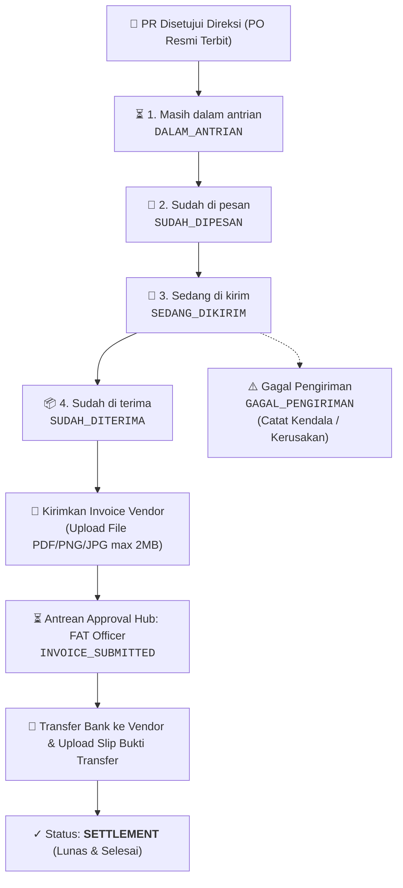

# 🌟 Walkthrough: Modul Utama "Pesanan" & Pembaharuan Pengadaan ERP MMS v3.2

Dokumentasi lengkap implementasi modul utama **"Pesanan" (PO Execution, Delivery Tracking & FAT Invoice Settlement)** serta fitur **Klaim Reimbursement Operasional** pada ERP MMS v3.2.

---

## 📦 1. Modul Utama "Pesanan" (PO Execution & Tracking)

Modul **"Pesanan"** dirancang khusus untuk memonitor, mengeksekusi, dan mentracking seluruh Purchase Requisitions (PR) yang telah disetujui penuh oleh Direksi (*APPROVED / COMPLETED / PO Terbit*).

---

## 👥 2. Pengelola Utama (Designated Operators)

Sesuai instruksi dan struktur RBAC, hak kelola perubahan status dan pengiriman invoice dipegang langsung oleh:

1. **Muhammad Syafiq Al Ghifari** (`ID: SA-002`, `NIKA: K-2026-011` — Staf Ahli Keuangan & Anggaran)
2. **Syifa Izzatina** (`ID: SO-004`, `NIKA: K-2026-016` — Staff Operasional)
3. *Super Admin & Jajaran Direksi memiliki akses pengawasan (oversight), serta FAT Officer memproses pembayaran di Approval Hub.*

---

## ⚙️ 3. Fitur & Teknis Modul Pesanan

### A. 5 Pilihan Status Resmi (Dropdown Langsung di Tabel)
Perubahan status dilakukan secara instan melalui dropdown interaktif pada baris tabel:
1. **Masih dalam antrian** (`DALAM_ANTRIAN`): Status awal otomatis setelah PR disetujui Direksi.
2. **Sudah di pesan** (`SUDAH_DIPESAN`): Barang telah dipesankan ke rekanan/supplier.
3. **Sedang di kirim** (`SEDANG_DIKIRIM`): Barang dalam perjalanan kurir/ekspedisi.
4. **Sudah di terima** (`SUDAH_DITERIMA`): Barang telah tiba di lokasi dapur penerima. Memunculkan tombol **"📄 Kirimkan Invoice"**.
5. **Gagal Pengiriman** (`GAGAL_PENGIRIMAN`): Apabila barang tidak sesuai atau rusak saat tiba di lokasi. Membuka modal input penjelasan kendala dan mencatat log audit.

### B. Modal "Kirimkan Invoice Vendor ke FAT" (Ringkas & Efisien)
* **User Experience Ringkas**: Cukup hanya **Upload File Invoice / Kuitansi (PNG/JPG/PDF, max 2 MB)** tanpa perlu mengisi ulang form yang redundan.
* Sistem otomatis membaca data PR (ID, Nama Barang, Total Budget, Dapur Penerima) dan langsung meneruskannya ke antrean **FAT Officer** (`INVOICE_SUBMITTED`).

### C. Antrean Approval Hub: FAT Officer & Settlement
* FAT Officer (`FAT-001` Muhammad Imam Adamy) menerima notifikasi dan kartu antrean di **Approval Hub** pada filter **Invoice Pesanan (FAT)**.
* FAT Officer dapat melakukan **Pratinjau Berkas Invoice Vendor (Lightbox/PDF)**, mengisi nomor referensi transfer bank, melampirkan foto slip transfer, dan mengonfirmasi pelunasan.
* Status pesanan berubah menjadi **`SETTLEMENT`** (Selesai & Lunas).
* Muhammad Syafiq dan Syifa Izzatina dapat langsung melihat dan mengunduh **Bukti Transfer Bank** dari FAT di tabel Pesanan.

### D. Fitur Filter & Audit Trail
* **4 HUD Metrics Cards**: Total Pesanan PO, Dalam Antrean, Sedang Dikirim, dan Selesai/Settlement.
* **Live Keyword Search**: Pencarian instan berdasarkan nama barang, nomor PR/PO, nama dapur, pemohon, dsb.
* **Filter Tabs**: Filter cepat per status pesanan.
* **Modal Log Audit Trail (Timeline)**: Menampilkan riwayat kronologis lengkap dari pengajuan awal, otorisasi Direksi, pergerakan tracking pesanan, hingga pencairan transfer bank FAT.

---

## 💻 4. Berkas yang Diperbarui / Dibuat

| Berkas / Modul | Rincian Perubahan |
| :--- | :--- |
| [`js/modules/pesanan.js`](file:///c:/Users/muham/Documents/SISTEM%20ERP/ERP%20MMS%20v3.2/js/modules/pesanan.js) *(BARU)* | Modul Pesanan: 4 HUD metrics, filter pills, search input, tabel tracking pesanan dengan dropdown status, modal upload invoice vendor (single-file upload max 2MB), modal catatan gagal pengiriman, modal timeline riwayat log, viewer invoice dan bukti transfer bank. |
| [`js/modules/data.js`](file:///c:/Users/muham/Documents/SISTEM%20ERP/ERP%20MMS%20v3.2/js/modules/data.js) | Menambahkan methods `getApprovedOrders()`, `updateOrderStatus()`, `submitOrderInvoice()`, `disburseOrderInvoice()`, `fetchOrderInvoiceAttachment()`, `fetchOrderTransferProof()`, update `getPendingApprovalsCount()`, serta mapping sinkronisasi Supabase Cloud. |
| [`js/modules/approval-center.js`](file:///c:/Users/muham/Documents/SISTEM%20ERP/ERP%20MMS%20v3.2/js/modules/approval-center.js) | Menambahkan filter tab dan antrean pending settlement invoice vendor untuk FAT Officer, modal transfer pembayaran vendor (`openDisburseOrderInvoiceModal`), preview invoice, dan audit log riwayat settlement. |
| [`js/app.js`](file:///c:/Users/muham/Documents/SISTEM%20ERP/ERP%20MMS%20v3.2/js/app.js) | Mendaftarkan route `'pesanan'`, sinkronisasi badge counter aktif (`#badge-pesanan-count`), dan navigasi. |
| [`index.html`](file:///c:/Users/muham/Documents/SISTEM%20ERP/ERP%20MMS%20v3.2/index.html) | Menambahkan tombol navbar pill `Pesanan`, tombol drawer mobile `Pesanan & PO`, modal global lightbox, dan registrasi script `pesanan.js`. |
| [`js/modules/pengajuan-barang.js`](file:///c:/Users/muham/Documents/SISTEM%20ERP/ERP%20MMS%20v3.2/js/modules/pengajuan-barang.js) | Menambahkan tombol navigasi cepat ke **Pesanan & PO**. |
| [`js/modules/cash-advance.js`](file:///c:/Users/muham/Documents/SISTEM%20ERP/ERP%20MMS%20v3.2/js/modules/cash-advance.js) | Menambahkan tombol navigasi cepat ke **Pesanan & PO**. |
| [`js/modules/reimburse.js`](file:///c:/Users/muham/Documents/SISTEM%20ERP/ERP%20MMS%20v3.2/js/modules/reimburse.js) | Menambahkan tombol navigasi cepat ke **Pesanan & PO**, ID SPPG pada dropdown dapur, dan lazy loading bukti struk. |
| [`schema_supabase.sql`](file:///c:/Users/muham/Documents/SISTEM%20ERP/ERP%20MMS%20v3.2/schema_supabase.sql) | Menambahkan kolom `order_status`, `order_tracking_history`, `order_invoice`, `order_disbursement` pada tabel `item_requests` dan skrip migrasi `ALTER TABLE`. |

---

## 🧪 5. Verifikasi & Pengujian

- ✅ **Akses Operator Terverifikasi**: Akun `SA-002` (Muhammad Syafiq Al Ghifari) dan `SO-004` (Syifa Izzatina) memiliki hak penuh untuk mengubah status pesanan melalui dropdown langsung dan mengunggah invoice vendor.
- ✅ **5 Status Pesanan**: Dropdown langsung merespon pergantian status (`DALAM_ANTRIAN`, `SUDAH_DIPESAN`, `SEDANG_DIKIRIM`, `SUDAH_DITERIMA`, `GAGAL_PENGIRIMAN`) dan mencatat riwayat audit real-time timestamp ke database.
- ✅ **Upload File Invoice Vendor**: Form hanya meminta upload file invoice (PNG/JPG/PDF, limit 2MB) dan meneruskan status ke `INVOICE_SUBMITTED`.
- ✅ **Antrean FAT Officer**: FAT Officer (`FAT-001`) menerima antrean tagihan invoice di Approval Hub, dapat mempratinjau invoice, dan menyelesaikan settlement dengan mengunggah bukti transfer bank.
- ✅ **Pratinjau Bukti Transfer**: Operator (`SA-002` / `SO-004`) dapat melihat langsung slip transfer bank yang telah diunggah oleh FAT Officer.
- ✅ **Live Filter & Keyword Search**: Filter tabs dan kotak pencarian real-time berfungsi responsif di seluruh baris tabel pesanan.

