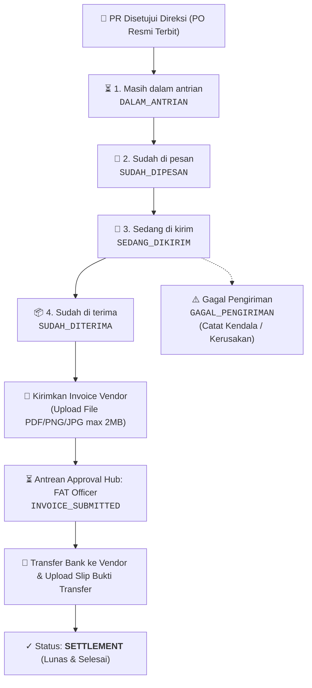

# 🌟 Walkthrough: Modul Utama "Pesanan" & Pembaharuan Pengadaan ERP MMS v3.2

Dokumentasi lengkap implementasi modul utama **"Pesanan" (PO Execution, Delivery Tracking & FAT Invoice Settlement)** serta fitur **Klaim Reimbursement Operasional** pada ERP MMS v3.2.

---

## 📦 1. Modul Utama "Pesanan" (PO Execution & Tracking)

Modul **"Pesanan"** dirancang khusus untuk memonitor, mengeksekusi, dan mentracking seluruh Purchase Requisitions (PR) yang telah disetujui penuh oleh Direksi (*APPROVED / COMPLETED / PO Terbit*).

---

## 👥 2. Hak Akses & Pembagian Visibilitas (Role-Based Scoping Matrix)

Sesuai instruksi dan struktur RBAC Yayasan MMS, modul **Pesanan** menerapkan pembagian visibilitas dan hak kontrol sebagai berikut:

| Kategori Akun / Pengguna | Cakupan Data Pesanan yang Tampil | Hak Akses & Kontrol di Tabel |
| :--- | :--- | :--- |
| **Operator Utama** 1. `SA-002` (Muhammad Syafiq Al Ghifari) 2. `SO-004` (Syifa Izzatina) | **Seluruh Pesanan Yayasan (Global View)** | **Full Control**: Mengubah status pesanan via dropdown langsung, mencatat alasan gagal kirim, dan mengunggah invoice supplier untuk diteruskan ke FAT. |
| **FAT Officer** (`FAT-001` / `usr-checker`) | **Seluruh Pesanan Yayasan (Global View)** | **Settlement & Audit**: Memverifikasi berkas invoice supplier di Approval Hub, mengunggah bukti transfer pelunasan, dan memantau seluruh pesanan. |
| **Jajaran Direksi & Super Admin** (`DIREKTUR_UTAMA`, `DIREKTUR_OPERASIONAL`, `DIREKTUR_KEUANGAN`, `SUPER_ADMIN`) | **Seluruh Pesanan Yayasan (Global View)** | **Executive Oversight & Management**: Mengawasi seluruh pesanan yayasan dan status pengadaan di semua lokasi dapur. |
| **Semua Akun Pemohon Lainnya** *(Manager Area, Staff Lapangan, Surveyor, Perwakilan Yayasan, HC, dsb.)* | **Hanya Pesanan dari Pengajuan PR Mereka Sendiri (Scoped Tracking View)** | **Read-Only Tracking**: Memantau progress status pengadaan mereka (badge status rapi), melihat Log Audit Detail, foto PR, dan mengecek bukti transfer FAT saat pesanan telah settlement/lunas. |

---

## ⚙️ 3. Fitur & Teknis Modul Pesanan

### A. Scoped Personal Tracking & Header Dinamis
* **Header & Banner Adaptif**: Menampilkan label *"📦 PO Execution & Delivery Tracking"* untuk Operator/Direksi/FAT, dan *"🔍 Pelacakan Pesanan Mandiri"* untuk pemohon umum beserta nama pemohon.
* **HUD Metrics Tersinkronisasi**: Kartu KPI dan counter filter badge secara dinamis menghitung data pesanan yang relevan sesuai akun yang sedang aktif.
* **Tampilan Status Bersih untuk Non-Operator**: Pemohon reguler melihat badge status visual yang informatif tanpa intervensi dropdown yang membingungkan.

### B. 5 Pilihan Status Resmi (Dropdown Langsung di Tabel untuk Operator)
Perubahan status dilakukan secara instan melalui dropdown interaktif pada baris tabel (khusus akun operator/direksi):
1. **Masih dalam antrian** (`DALAM_ANTRIAN`): Status awal otomatis setelah PR disetujui Direksi.
2. **Sudah di pesan** (`SUDAH_DIPESAN`): Barang telah dipesankan ke rekanan/supplier.
3. **Sedang di kirim** (`SEDANG_DIKIRIM`): Barang dalam perjalanan kurir/ekspedisi.
4. **Sudah di terima** (`SUDAH_DITERIMA`): Barang telah tiba di lokasi dapur penerima. Memunculkan tombol **"📄 Kirimkan Invoice"** bagi operator.
5. **Gagal Pengiriman** (`GAGAL_PENGIRIMAN`): Apabila barang tidak sesuai atau rusak saat tiba di lokasi. Membuka modal input penjelasan kendala dan mencatat log audit.

### C. Modal "Kirimkan Invoice Vendor ke FAT" (Ringkas & Efisien)
* **User Experience Ringkas**: Cukup hanya **Upload File Invoice / Kuitansi (PNG/JPG/PDF, max 2 MB)** tanpa perlu mengisi ulang form yang redundan.
* Sistem otomatis membaca data PR (ID, Nama Barang, Total Budget, Dapur Penerima) dan langsung meneruskannya ke antrean **FAT Officer** (`INVOICE_SUBMITTED`).

### D. Antrean Approval Hub: FAT Officer & Settlement
* FAT Officer (`FAT-001` Muhammad Imam Adamy) menerima notifikasi dan kartu antrean di **Approval Hub** pada filter **Invoice Pesanan (FAT)**.
* FAT Officer dapat melakukan **Pratinjau Berkas Invoice Vendor (Lightbox/PDF)**, mengisi nomor referensi transfer bank, melampirkan foto slip transfer, dan mengonfirmasi pelunasan.
* Status pesanan berubah menjadi **`SETTLEMENT`** (Selesai & Lunas).
* Seluruh pihak terkait (operator maupun pemohon PR bersangkutan) dapat langsung melihat dan mengunduh **Bukti Transfer Bank** dari FAT di tabel Pesanan.

### F. Desain Responsif Mobile & Desktop (Hybrid Layout)
* **Desktop & Tablet View (`> 768px`)**: Tabel berdensitas tinggi dengan `min-width: 1100px` dan scroll horizontal yang mulus tanpa teks terjepit.
* **Mobile Card View (`<= 768px`)**: Kartu pesanan mandiri yang proporsional, rapi, dan lega di layar smartphone, memuat:
  - Header badge ID PR, tanggal, dan status PO resmi.
  - Nama barang, kuantiti, dan nominal anggaran dengan font monospaced emas yang menonjol.
  - Kotak informasi dapur SPPG dan pemohon yang jelas terbaca tanpa terpotong.
  - Dropdown kontrol status (operator) atau status badge visual (pemohon).
  - Box info status tagihan vendor dan tombol aksi (Kirim Invoice / Cek Invoice / Bukti Transfer).
  - Tombol aksi: Log Detail PO & Foto PR Lightbox.

---

## 💻 4. Berkas yang Diperbarui / Dibuat

| Berkas / Modul | Rincian Perubahan |
| :--- | :--- |
| [`js/modules/pesanan.js`](file:///c:/Users/muham/Documents/SISTEM%20ERP/ERP%20MMS%20v3.2/js/modules/pesanan.js) *(BARU)* | Modul Pesanan: Scoping visibilitas data, 4 HUD metrics, filter pills, search input, tabel tracking pesanan dengan dropdown status untuk operator, **Hybrid Responsive Mobile Cards**, modal upload invoice vendor (single-file upload max 2MB), modal catatan gagal pengiriman, modal timeline riwayat log, viewer invoice dan bukti transfer bank. |
| [`css/style.css`](file:///c:/Users/muham/Documents/SISTEM%20ERP/ERP%20MMS%20v3.2/css/style.css) | Menambahkan class `.pesanan-desktop-view` dan `.pesanan-mobile-view` beserta breakpoint `@media (max-width: 768px)` untuk rendering kartu mobile yang proporsional. |
| [`js/modules/data.js`](file:///c:/Users/muham/Documents/SISTEM%20ERP/ERP%20MMS%20v3.2/js/modules/data.js) | Menambahkan methods `getApprovedOrders()`, `updateOrderStatus()`, `submitOrderInvoice()`, `disburseOrderInvoice()`, `fetchOrderInvoiceAttachment()`, `fetchOrderTransferProof()`, update `getPendingApprovalsCount()`, serta mapping sinkronisasi Supabase Cloud. |
| [`js/modules/approval-center.js`](file:///c:/Users/muham/Documents/SISTEM%20ERP/ERP%20MMS%20v3.2/js/modules/approval-center.js) | Menambahkan filter tab dan antrean pending settlement invoice vendor untuk FAT Officer, modal transfer pembayaran vendor (`openDisburseOrderInvoiceModal`), preview invoice, dan audit log riwayat settlement. |
| [`js/app.js`](file:///c:/Users/muham/Documents/SISTEM%20ERP/ERP%20MMS%20v3.2/js/app.js) | Mendaftarkan route `'pesanan'`, sinkronisasi badge counter aktif (`#badge-pesanan-count`) berbasis role scoping, dan navigasi. |
| [`index.html`](file:///c:/Users/muham/Documents/SISTEM%20ERP/ERP%20MMS%20v3.2/index.html) | Menambahkan tombol navbar pill `Pesanan`, tombol drawer mobile `Pesanan & PO`, modal global lightbox, dan registrasi script `pesanan.js`. |
| [`js/modules/pengajuan-barang.js`](file:///c:/Users/muham/Documents/SISTEM%20ERP/ERP%20MMS%20v3.2/js/modules/pengajuan-barang.js) | Menambahkan tombol navigasi cepat ke **Pesanan & PO**. |
| [`js/modules/cash-advance.js`](file:///c:/Users/muham/Documents/SISTEM%20ERP/ERP%20MMS%20v3.2/js/modules/cash-advance.js) | Menambahkan tombol navigasi cepat ke **Pesanan & PO**. |
| [`js/modules/reimburse.js`](file:///c:/Users/muham/Documents/SISTEM%20ERP/ERP%20MMS%20v3.2/js/modules/reimburse.js) | Menambahkan tombol navigasi cepat ke **Pesanan & PO**, ID SPPG pada dropdown dapur, dan lazy loading bukti struk. |
| [`schema_supabase.sql`](file:///c:/Users/muham/Documents/SISTEM%20ERP/ERP%20MMS%20v3.2/schema_supabase.sql) | Menambahkan kolom `order_status`, `order_tracking_history`, `order_invoice`, `order_disbursement` pada tabel `item_requests` dan skrip migrasi `ALTER TABLE`. |

---

## 🧪 5. Verifikasi & Pengujian

- ✅ **Tampilan Mobile Proporsional (Mobile Card Layout)**: Pada layar HP/smartphone (`<= 768px`), tabel padat secara otomatis bertransformasi menjadi **kartu pesanan vertikal yang lega, estetik, dan proporsional**. Teks dapur, nama barang, pemohon, dan nominal anggaran tersusun rapi tanpa ada teks yang tertekan menjadi 1 huruf vertikal.
- ✅ **Tampilan Desktop & Tablet Aman**: Pada layar desktop/laptop/tablet, tabel memiliki pengaman `min-width: 1100px` dan container dengan horizontal touch-scroll sehingga seluruh 7 kolom data tetap lebar dan proporsional.
- ✅ **Pemisahan Hak Visibilitas Data (Role-Based Scoping)**:
  - Akun **Syifa Izzatina** (`SO-004`), **Muhammad Syafiq Al Ghifari** (`SA-002`), **FAT Officer** (`FAT-001`), dan **Direksi / Super Admin** dapat melihat **SELURUH** pesanan pengadaan se-yayasan.
  - Akun **selain mereka** (misalnya Rendy Seftiana / Manager Area / Surveyor / Staff) **HANYA** melihat tracking pesanan yang diajukan oleh mereka sendiri.
- ✅ **Akses Operator Terverifikasi**: Akun `SA-002` (Muhammad Syafiq Al Ghifari) dan `SO-004` (Syifa Izzatina) memiliki hak penuh untuk mengubah status pesanan melalui dropdown langsung dan mengunggah invoice vendor.
- ✅ **Proteksi Akun Pemohon Reguler**: Akun pemohon reguler melihat badge status yang rapi (non-editable status dropdown) dan tetap dapat melihat detail log riwayat pengiriman barang, foto PR, serta melihat slip transfer FAT saat pesanan telah settlement (Lunas).
- ✅ **Live Filter & Keyword Search**: Filter tabs dan kotak pencarian real-time berfungsi responsif di seluruh kartu mobile maupun baris tabel desktop.

