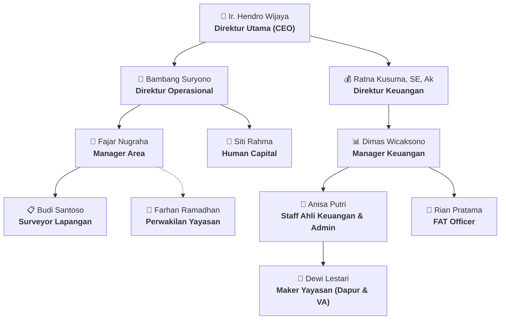

# 🌟 Walkthrough: Transformasi ERP YAYASAN (Enterprise Management System)

Seluruh struktur organisasi kantor (11 Roles/Jabatan), aturan persetujuan bertingkat (*Multi-Tier Approval Rules*), regulasi cuti & izin (**Pasal 14, 15, & 16**), master database Dapur Program, modul **Maker Yayasan (Pelaporan Dapur & Saldo Virtual Account)**, serta **Pusat Dokumen Panduan & Sosialisasi Yayasan** telah terintegrasi penuh ke dalam sistem dengan identitas visual resmi: **ERP YAYASAN**.

---

## 🏢 1. Peta Struktur Organisasi & 11 Akun Pengguna

---

## 📜 2. Implementasi Regulasi Cuti & Izin (Pasal 14, 15, & 16)

### B. Regulasi Cuti Adaptif Berdasarkan Masa Kerja & Format Ketentuan Kebijakan
1. **Mekanisme Cuti Berdasarkan Masa Kerja (*Tenure-Based Leave Engine*):**
   * **Karyawan Masa Kerja < 1 Tahun:**
     * Berlaku **Cuti Pribadi (*Personal Leave*)** kuartalan (1 hari/bulan, diakumulasi kuartalan, hangus di akhir kuartal).
     * Kontainer/kartu **Cuti Tahunan (*Annual Leave*) sepenuhnya disembunyikan (*hidden*)** baik di dashboard maupun modul Cuti, dan tidak muncul pada form pengajuan.
   * **Karyawan Masa Kerja $\ge$ 1 Tahun:**
     * Berlaku **Cuti Tahunan (*Annual Leave*)** 12 hari/tahun (hak normatif penuh, carry over maks. 4 hari).
     * Kontainer/kartu **Cuti Pribadi (*Personal Leave*) sepenuhnya disembunyikan (*hidden*)** baik di dashboard maupun modul Cuti, dan tidak muncul pada form pengajuan.
2. **Tata Letak Modul Cuti yang Proporsional (*Layout Hierarchy*):**
   * **Bagian Atas:** 2 Kartu Metrik HUD Saldo Cuti Aktif & Izin Khusus.
   * **Bagian Tengah:** **Tabel Riwayat Pengajuan Cuti & Izin Karyawan** (*Audit Trail & Status Approval*).
   * **Bagian Bawah:** **Ketentuan Pengajuan Cuti & Izin Berdasarkan Peraturan Perusahaan** (Disajikan dalam format poin sebaris dengan deskripsi rapi di bawahnya).
* **Ketentuan Pengajuan H-7:**
  * Wajib diajukan selambat-lambatnya **1 minggu (7 hari)** sebelum pelaksanaan cuti (sistem otomatis mendeteksi dan memberi alert peringatan jika diajukan kurang dari 7 hari).

---

* **Hari Pertama Waktu Haid Sakit:** 1 hari kerja (dengan izin atasan).
* **Istirahat Melahirkan:** 3 bulan berturut-turut (1,5 bulan sebelum + 1,5 bulan sesudah melahirkan) dengan upah penuh. Wajib surat dokter H-30 dan fotokopi akte kelahiran H+40.
* **Istirahat Keguguran:** 1,5 bulan berturut-turut (45 hari kalender) dengan upah penuh + surat keterangan dokter.

---

### C. Pasal 16: Izin Meninggalkan Pekerjaan dengan Upah (Special Paid Leave)
* **Pernikahan Karyawan Sendiri:** 3 hari kerja
* **Karyawan Menikahkan Anak:** 2 hari kerja
* **Pengkhitanan Anak:** 2 hari kerja
* **Baptis Karyawan / Keluarga Inti:** 2 hari kerja
* **Potong Gigi (Hindu) Karyawan / Keluarga Inti:** 2 hari kerja
* **Istri Sah Melahirkan / Keguguran:** 2 hari kerja (khusus laki-laki)
* **Duka Keluarga Inti (Istri/Suami/Ortu/Mertua/Anak/Saudara Kandung):** 2 hari kerja
* **Duka Anggota Serumah:** 1 hari kerja
* **Bencana Alam (Banjir / Kebakaran):** 2 hari kerja
* **Ibadah Luar Negeri (Haji / Umroh / Lainnya):** Sesuai surat resmi Kemenag/Travel (diajukan 1 bulan sebelumnya).

### B. Timesheet & Presensi
* **Surveyor Lapangan:** Berbasis survei mandiri (Auto-logged & Approved untuk monitoring tanpa membebani Manager Area).
* **Tim Keuangan & Lainnya:** Persetujuan/Validasi jam langsung oleh **Human Capital**.

### C. Pengadaan Barang (Purchase Requisition - PR)
* **Pengajuan Reguler (Surveyor / Staff / FAT / Perwakilan Yayasan):**
  1. Pemohon submit PR + Foto Spesifikasi.
  2. **Manager (Area / Keuangan)** memvalidasi urgensi.
  3. **Staff Ahli Keuangan / FAT Officer** memverifikasi anggaran.
  4. **Direktur Keuangan / Direktur Operasional** memberikan persetujuan akhir & terbitkan Purchase Order (PO).
* **Pengajuan Khusus Manager Area (Kebutuhan Dapur):**
  1. Manager Area memilih **Nama Dapur Program**.
  2. *Langsung skip ke Tahap 2 (Verifikasi Anggaran Keuangan)* $\rightarrow$ Persetujuan Akhir Direktur.

---

## 🍲 3. Modul Khusus: Pelaporan Dapur Program & Saldo VA (Maker Yayasan)

Untuk role **Maker Yayasan (`MY-001`)**, Tim Keuangan, dan Direksi:
* **Form Input Transaksi Harian:** Pilihan Dapur Program, Total Belanja Bahan Baku (Rp), Rincian Item (Beras, Daging, Sayur, Gas), Total Porsi Makanan (Penerima Manfaat), Bank & Nomor VA, Saldo VA Terkini, serta Catatan Distribusi.
* **4 KPI HUD Analytics:** Total Belanja Bahan Baku, Total Porsi Terbagi, Saldo VA Terkini, dan Biaya Rata-Rata per Porsi (Rp/porsi).
* **Master Database Dapur:** Terdaftar 5 Titik Dapur Program (*Dapur Sentral Harmoni, Dapur Berkah Bekasi, Dapur Gotong Royong Bandung, Dapur Surabaya, Dapur Yogyakarta*) + tombol penambahan titik dapur baru.
* **Tabel Rekapitulasi:** Audit trail mutasi harian dapur dan laporan keuangan program yayasan.

## 👥 4. Modul Baru: HC Hub (Human Capital Governance)
Khusus untuk role **Human Capital (`HC-001` - Siti Rahma)** dan **Direktur Utama**, tersedia menu navbar **HC Hub ▾** dengan floating dropdown berisikan 3 sub-modul utama:

1. **🏢 Struktur Perusahaan (Role & Hierarchy Mapping):**
   * Visualisasi kartu hirarki seluruh pemegang jabatan di bagan organisasi.
   * Tombol *✏️ Ganti Nama Pejabat* untuk memperbarui pemegang jabatan di setiap role secara dinamis.
2. **📋 Master Data Karyawan (HRIS Directory):**
   * Rekapitulasi data lengkap seluruh karyawan lintas divisi: NIK KTP (16 Digit), Tempat & Tanggal Lahir (TTL), Jenis Kelamin (Gender), Departemen, Nomor HP, Email, dan Saldo Kuota Cuti.
   * Pencarian instan (*real-time search bar*) dan fitur *✏️ Edit HRIS*.
3. **🔐 Pengelolaan Akun & Password (Identity & Access):**
   * Fitur *+ Tambah Akun Pengguna Baru* dengan form komprehensif (Username, Password, NIK, TTL, Gender, Role, dan Departemen).
   * Fitur *👁️ Toggle Password*, *🔑 Reset Password*, dan *🗑️ Hapus / Nonaktifkan Akun*.

---

## 🛡️ 5. Penyesuaian Hak Akses (RBAC Matrix Mutakhir)
* **Laporan Dapur (VA):** Menu ini dikunci secara presisi dan **HANYA muncul** untuk 5 role berikut:
  1. 👑 **Direktur Utama** (`DU-001` - Ir. Hendro Wijaya)
  2. 💰 **Direktur Keuangan** (`DK-001` - Ratna Kusuma, SE, Ak)
  3. 🏢 **Direktur Operasional** (`DO-001` - Bambang Suryono)
  4. 💼 **Staff Ahli Keuangan dan Administrasi** (`SA-001` - Anisa Putri)
  5. 🔴 **Maker Yayasan** (`MY-001` - Dewi Lestari)
  *(Seluruh role lainnya seperti Manager Area, Manager Keuangan, FAT Officer, Human Capital, Surveyor, dan Perwakilan Yayasan tidak melihat menu ini).*
* **HC Hub ▾:** HANYA muncul untuk **Human Capital** (`HC-001`) dan **Direktur Utama** (`DU-001`). Memiliki 4 sub-view utama.

---

## 📚 3. Pusat Dokumen Sosialisasi & Panduan Yayasan (PDF & PPT)

### A. Dashboard Khusus Perwakilan Yayasan (`PY-001` - Farhan Ramadhan)
Menampilkan section terdedikasi **"📚 Dokumen Sosialisasi, SOP & Panduan Resmi Yayasan"**:
* 📄 **SOP Lapangan & Verifikasi (PDF):** *Panduan Pelaksanaan & Standar Verifikasi Lapangan Program Yayasan 2026.pdf* (3.8 MB)
* 📊 **Materi Presentasi (PPT):** *Materi Sosialisasi Kebijakan & Alur Pengajuan Program Kemitraan Sosial.pptx* (12.4 MB)
* 📄 **Tata Kelola (PDF):** *Buku Saku Kode Etik, Tata Kelola & Nilai Integritas Yayasan 2026.pdf* (2.1 MB)

---

### B. Dashboard Khusus Maker Yayasan (`MY-001` - Dewi Lestari)
Menampilkan section terdedikasi yang terpisah dan relevan dengan operasional dapur & Virtual Account:
* 📄 **SOP Dapur & Finansial VA (PDF):** *SOP Pengelolaan Bahan Baku, Standar Porsi Dapur & Akuntabilitas Virtual Account.pdf* (4.5 MB)
* 📊 **Materi Sosialisasi & Training (PPT):** *Sosialisasi Higienitas Dapur Komersial & Manajemen Stok Bahan Makanan Segar.pptx* (15.2 MB)
* 📄 **Tata Kelola (PDF):** *Buku Saku Kode Etik, Tata Kelola & Nilai Integritas Yayasan 2026.pdf* (2.1 MB)

---

### C. Fitur Unggah Attachment & Unduh File Asli (*File Upload & Download*)
* **Kolom Upload File Interaktif di Modal HC Hub:**
  * Area *drag-and-drop / file selector* yang mendukung format `.PDF`, `.PPT`, `.PPTX`, `.DOC`, `.DOCX`.
  * **Otomasi Cerdas:** Ketika file dipilih, sistem secara otomatis membaca nama file, menghitung ukuran file (KB/MB), serta memilih tipe format (PDF/PPT) yang sesuai.
* **Tombol Unduh Langsung (*Direct Download*):**
  * Di dashboard **Perwakilan Yayasan** dan **Maker Yayasan**, setiap kartu panduan dilengkapi tombol **`📥 Unduh PDF`** / **`📥 Unduh PPT`**.
  * File yang diunggah oleh Human Capital dapat langsung diunduh secara nyata oleh tim yayasan di lapangan untuk dipelajari secara *offline*.
